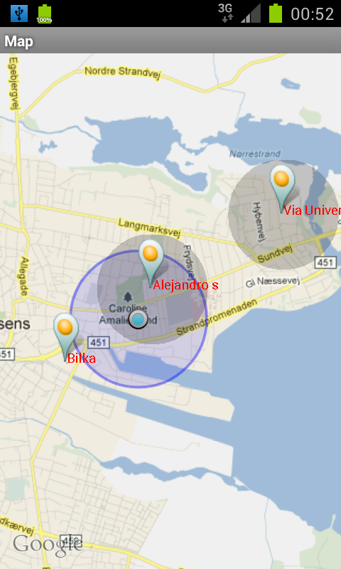

<!SLIDE title-slide>

# GeoAlarms #

<!SLIDE bullets transition=fade>

# Introduction #

* store alarms associated with geographical locations 
* notify the user when its close enough to an alarm

!SLIDE center transition=scrollUp
.notes another dark side

