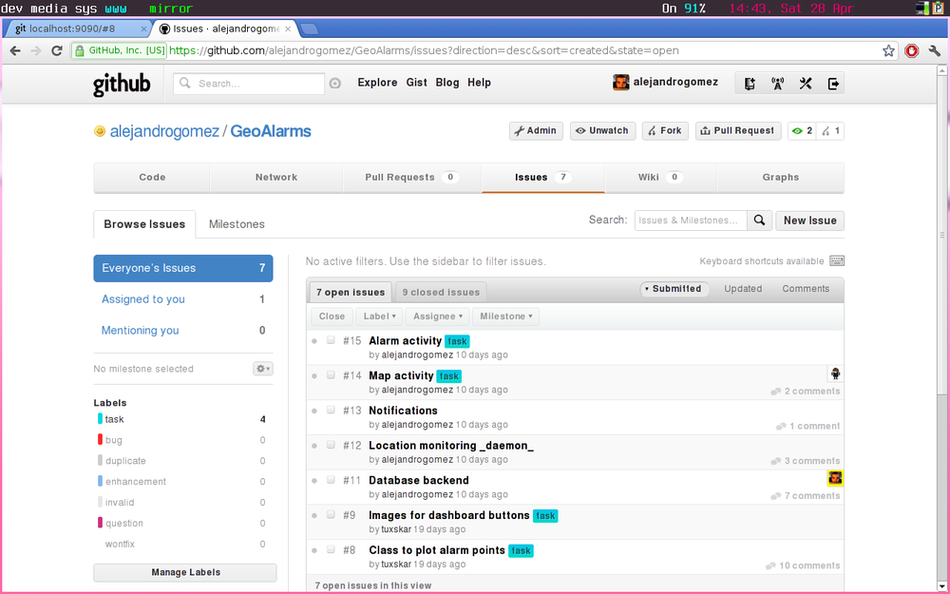

<!SLIDE title-slide transition=scrollUp>

# Let's get `meta`! #

!SLIDE team transition=fade

# Our needs #

* asynchronous collaboration
* code review
* be able to rollback if somebody introduces a bug
* discuss about the project 
* meetings in pyjamas

<!SLIDE smaller transition=scrollLeft>

# `git` remembers your history #

    @@@
    * 63688b8 (HEAD, master, develop) Last revision 
    * dfd4314 report almost finished
    * 8a07415 Added the images and report.odt
    ...
    *   eeeb807 Conflicts fixed
    |\  
    | * 6835c86 pretty alarm plotting
    | * 91b6734 custom overlay class for Alarms
    | * 8b4f235 namespace changes
    | * 09d5384 draw existing alarms when loading
    * | 91eb1ab (activity/newAlarm) Renamed NewAlarm 
    |/  
    * fdf845c use `GeoAlarms.alarmManager`
    ...
    * 919135e Initial commit

!SLIDE open source transition=scrollLeft

# Enter `GitHub`! #

* `git` hosting and project collaboration tools
* free for open source projects 
* cutest pet **ever**

<!SLIDE center transition=scrollLeft>

## `github.com/alejandrogomez/GeoAlarms` 

