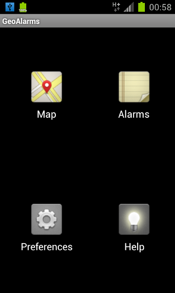
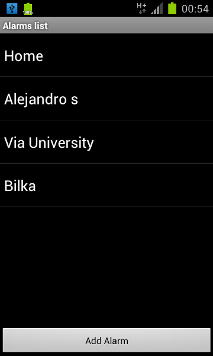
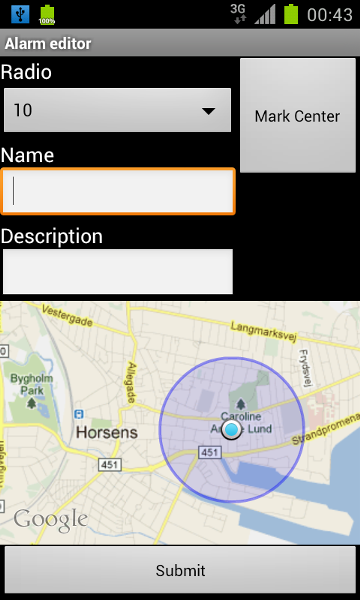
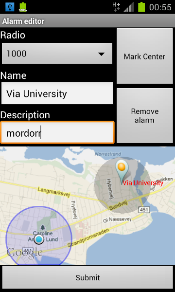
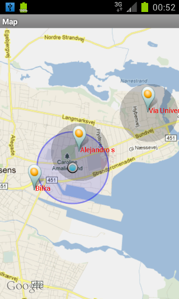
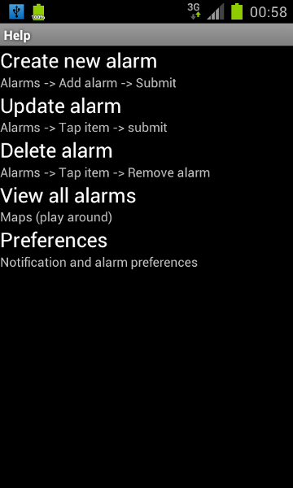

!SLIDE transition=fade

# `activity` #

    @@@
    ~/repos/GeoAlarms/src/main/java
    └── com
        └── geoalarms
            └── activity
                ├── AlarmEditor.java
                ├── AlarmList.java
                ├── Help.java
                ├── Home.java
                ├── Map.java
                └── Preferences.java

!SLIDE center transition=scrollDown
# Dashboard activity #

<!SLIDE center transition=scrollLeft>
# Alarm list #

.notes Button to add new alarm and listView to show all the alarms

<!SLIDE AlarmList smaller transition=scrollUp>
# Start new alarm #
    @@@ java
	public void addAlarm(View v) {
		Intent in = new 
            Intent(AlarmList.this, AlarmEditor.class);
		in.putExtra("activity_type", "add");
		this.startActivityForResult(in, 
            GeoAlarms.NEW_ALARM_ACTIVITY);
	}

!SLIDE center transition=scrollDown
# Alarm editor #

.notes an spinner for the radius, button for mark in the center, textfields for name and description and submit button to save. Then we can add alarm

<!SLIDE AlarmList smaller transition=scrollUp>
# Start alarm to edit #
    @@@ java
    alarmlist = (ListView) 
            this.findViewById(R.id.alarmlist);
    alarmlist.setOnItemClickListener(
        new AdapterView.OnItemClickListener() {
        public void onItemClick(AdapterView parent, 
                View v, int position, long id){
               
          String alarmName = alarmNames.get(position);
          Alarm alarm = 
            GeoAlarms.alarmManager.getAlarm(alarmName);
          Intent in = new 
                Intent(AlarmList.this, AlarmEditor.class);
          in.putExtra("name", alarm.name);
          startActivityForResult(in, 
                    GeoAlarms.NEW_ALARM_ACTIVITY);
        }
    });

!SLIDE center transition=scrollDown
# Alarm editor #

.notes it has the remove button, then we can edit or remove an alarm in the same screen

!SLIDE smaller transition=scrollUp
# On submit from editor activity #
    @@@ java
	public void onSubmit(View v) {
    ...
     // send data back
     submitIntent.putExtra("radius", radius);
     submitIntent.putExtra("latitude", point.latitude);
     submitIntent.putExtra("longitude", point.longitude);
     submitIntent.putExtra("name", name);
     submitIntent.putExtra("description", description);

     if (this.edit) {
         // this activity come from edit mode
         setResult(GeoAlarms.UPDATEALARM, submitIntent);
     } else {
         setResult(GeoAlarms.NEWALARM, submitIntent);
     }

     finish();
    ...
    }

.notes the editor retreive all the information to create a new alarm or modify one that already was

!SLIDE center transition=scrollDown
# Map activity #

!SLIDE center transition=scrollLeft
# Preferences activity #

!SLIDE center transition=scrollLeft
# Help activity #

