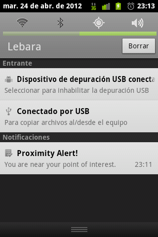

!SLIDE small source

# location #

    @@@
    ~/repos/GeoAlarms/src/main/java
    └── com
        └── geoalarms
            └── location
                ├── LocListener.java
                └── ProximityIntentReceiver.java

!SLIDE smaller
# LocListener  
    @@@ java
    public class LocListener implements LocationListener {
        //...
        locManager.requestLocationUpdates(
            LocationManager.GPS_PROVIDER, 1000, 1f, this);
        locManager.requestLocationUpdates(
            LocationManager.NETWORK_PROVIDER, 100, 1f, this);
        //...
        for (Alarm alarm : alarms) {
            addProximityAlert(
                  alarm.coordinates.getLatitude(),
                  alarm.coordinates.getLongitude(), 
                  alarm.radius,
                  NOEXPIRATION, 
                  this.pendingIntent);
        }
        //...
    } 

.notes we use a fine location using both system of location, GPS and Network

<!SLIDE smaller >
# ProximityIntentReceiver 
    @@@ java
    public class ProximityIntentReceiver 
                                extends BroadcastReceiver {
      //...
      String key = LocationManager.KEY_PROXIMITY_ENTERING;
      //...

      private Notification createNotification() {
        Notification notification = new Notification();
        
        notification.icon = R.drawable.ic_menu_agenda;
        notification.when = System.currentTimeMillis();
         
        notification.flags |= Notification.FLAG_AUTO_CANCEL;
        notification.flags |= Notification.FLAG_SHOW_LIGHTS;
         
        notification.defaults |= Notification.DEFAULT_VIBRATE;
        notification.defaults |= Notification.DEFAULT_LIGHTS;
         
        return notification;
      }
      //...
    } 

!SLIDE
# Notification #

